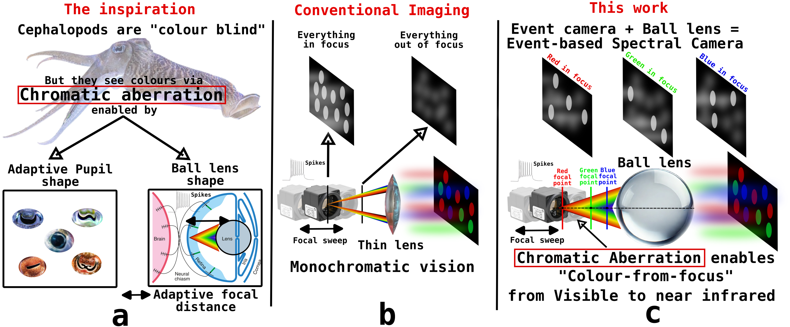

# Seeing like a Cephalopod: Colour Vision with a Monochrome Event Camera [CVPRW2025]

Code and analysis for **Seeing like a Cephalopod: Colour Vision with a Monochrome Event Camera**


<table align="center">
  <tr>
    <td align="center" style="border:none;">
      <a href="https://samiarja.github.io/neuromorphic_octopus_eye/" target="_blank">
        
      </a>
    </td>
    <td align="center" style="border:none;">
      <a href="https://arxiv.org/pdf/2504.10984" target="_blank">
        
      </a>
    </td>
    <td align="center" style="border:none;">
      <a href="./figures/CVPR25_Neuromorphic_Cephalopod_Eye.pdf" target="_blank">
        
      </a>
    </td>
  </tr>
  <tr>
    <td align="center" style="border:none;">Project Page</td>
    <td align="center" style="border:none;">Paper</td>
    <td align="center" style="border:none;">Poster</td>
  </tr>
</table>


> **TL;DR**  
> A cheap glass ball plus a monochrome sensor—frame _or_ event—is enough to unlock compact, passive hyperspectral vision, by leveraging the lens’s intrinsic chromatic aberration much like how cephalopod see the world underwater.
>


### Citation

If you find this work useful, please cite our paper:

```bibtex
@inproceedings{arja_cephalopod_CVPRW_2025,
      title     = {Seeing like a Cephalopod: Colour Vision with a Monochrome Event Camera},
      author    = {Arja, Sami and Kruger, Nimrod and Marcireau, Alexandre and Ralph, Nicholas Owen and Afshar, Saeed and Cohen, Gregory},
      booktitle = {Proceedings of the IEEE/CVF Conference on Computer Vision and Pattern Recognition Workshop (CVPRW)},
      year      = {2025}
}
```


<p align="center">
  
</p>


# Summary
Everything you need to reproduce the paper in one place:

- **Datasets**  
  - Frame sequences from the **[Sony IMX-249](https://en.ids-imaging.com/store/u3-3262se-rev-1-2.html)** camera in .tiff format.
  - Event streams from the **[Prophesee IMX-636](https://www.prophesee.ai/event-based-sensor-imx636-sony-prophesee/)** camera in .es format.
  - Event and frame data from the **cephalopod-inspired optical simulator**.

> **Link to the dataset:** https://drive.google.com/drive/folders/1pCy3_B0G8gbo8CL2wyq7y7bzFZ_2gPin?usp=sharing
- **Hardware assets**  
  - [3-D CAD files](3D_CAD_files) and drawings for the ball-lens optical assembly.

- **Software**  
  - Source code for the [cephalopod-inspired optical simulator](Sphere_ray_simulator).
  - Analysis scripts and plotting in: [hyperspectral_analysis_scripts](hyperspectral_analysis_scripts).


Use these resources to rerun the analyses, rebuild the optics, or extend the simulator for your own experiments.

> Please reach out if you would like to discuss and explore further applications for event-based hyperspectral sensing.
>

# Setup

## Requirements

- python: 3.9.x, 3.10.x
- Matlab 2023x

## Tested environments
- Ubuntu 22.04
- Conda 23.1.0
- Python 3.9.18

## Installation

```sh
git clone https://github.com/samiarja/OctoEye.git
cd OctoEye
conda env create -f environment.yml
conda activate octoeye
python3 -m pip install -e .
```


# Optical Components & Sensors

Figure 3 shows the optical setup in details.

| Component / Sensor | Key Specs | Notes |
|--------------------|-----------|-------|
| **100 mm Ball Lens** | Off-the-shelf glass ball <br>🔗 <https://lensball.com.au/shop/100mm-lensball/> | Introduces wavelength-dependent focal shifts characterised in this work |
| **IMX-636 (Prophesee DVS)** | 1280 × 720 px · 4.86 µm <br>Logarithmic pixels, asynchronous events | Used for event-based hyperspectral experiments |
| **IMX-249 (IDS)** | 1936 × 1216 px · 5.86 µm <br>Global shutter, linear response, frame output | Used for frame-based point-spread-function (PSF) analysis |

# Mechanical Components

| Item | Role in the Setup | Key Specs & Link |
|------|------------------|------------------|
| **Glideforce LACT4P-12V-10 Linear Actuator (Feedback)** | Translates the camera along the optical axis; the built-in potentiometer lets us map actuator position directly to focal distance. | 25 kgf · 4 in (3.9 in usable) stroke · 1.1 in/s · 12 V  🔗 [Datasheet / product page](https://core-electronics.com.au/glideforce-lact12-12v-10-light-duty-linear-actuator-25kgf-12-stroke-11-8-usable-1-1-s-12v.html) |
| **Pololu Jrk G2 21v3 USB Motor Controller (Feedback)** | Drives the actuator and streams position feedback over USB/TTL, enabling closed-loop control from Python/Matlab scripts. | 6.5 – 30 V input · up to 3 A continuous · native USB + serial  🔗 [Product page](https://core-electronics.com.au/jrk-g2-21v3-usb-motor-controller-with-feedback-connectors-soldered.html) |


# Data processing and analysis

### 1. Data folders

| Folder | Contents | Used in Paper |
|--------|----------|---------------|
| `imx-636-data/` | Event streams captured from IMX-636 for 400–1000 nm (50 nm step) | Fig. 6 (b-c), Fig. 7 (EVK4), Fig. 8 |
| `imx-249-data/` | Frames captured from IMX-249 for 400–1000 nm (50 nm step) | Fig. 2, Fig. 7 (IMX-249) |
| `octopus_matlab_simulator/` | Simulated frames (later converted to events) | Fig. 5 |


### 2. Analysis scripts

| Script | What it Generates | Purpose |
|--------|-------------------|---------|
| [PSF_grid_imx249_frames.m](hyperspectral_analysis_scripts/PSF_grid_imx249_frames.m) | Grid of PSFs vs. wavelength & focus | Shows unique focus for each wavelength (frames) |
| [PSF_grid_simulator_frames.m](hyperspectral_analysis_scripts/PSF_grid_simulator_frames.m) | Same as above but for simulator output | Validates optical simulator with real data |
| [spectral_discrimination_ratio_figure8.m](hyperspectral_analysis_scripts/spectral_discrimination_ration_figure8.m) | Spectral-discrimination ratio + ocean-depth light curves | Evaluates colour-from-focus discrimination performance |
| [event_hyperspectral_pointcloud_figure6b.m](hyperspectral_analysis_scripts/event_hyperspectral_pointcloud_figure6b.m) | 3-D point-cloud of event PSFs over time | Visualises wavelength-dependent focus in events in 3D |
| [focal_distance_wavelengths_imx636_dvs.m](hyperspectral_analysis_scripts/focal_distance_wavelengths_imx636_dvs.m) | Focal distance ↔ wavelength plot (events) | Quantifies non-linear relationship of focal distance |
| [PSF_grid_simulator_dvs.m](hyperspectral_analysis_scripts/PSF_grid_simulator_dvs.m) | Grid of simulated event PSFs | Shows unique focus for each wavelength (simulated events) |


# High level conclusions of this work

1. **Non-linear relationship between focal distance and wavelengths**  
   Focal distance varies non-linearly with wavelength.

2. **Red–NIR vs. Blue–Green focal point spacing**  
   Focus points for long wavelengths (≈ > 700 nm) cluster so closely with each other, reducing discrimination power, while blue–green bands remain well-separated.  
   *Cephalopod* do not benefit from red/NIR sensitivity because seawater absorbs those bands.

3. **Colour-from-Focus on both sensor types**  
   - **Frame sensor (IMX-249):** Chromatic aberration from the ball lens enables _discrete_ hyperspectral imaging.  
   - **Event sensor (IMX-636):** Chromatic aberration from the ball lens enables _continuous_ hyperspectral sensing thanks to asynchronous events.


## Useful references
- [Animal eyes by Micheal Land](https://www.amazon.com.au/Animal-Michael-Professor-Neurobiology-University/dp/0199581142)
- [Spectral discrimination in color blind animals via chromatic aberration and pupil shape](https://www.pnas.org/doi/10.1073/pnas.1524578113)
- [Ball lens explained by Veritasium](https://youtu.be/24GfgNtnjXc)